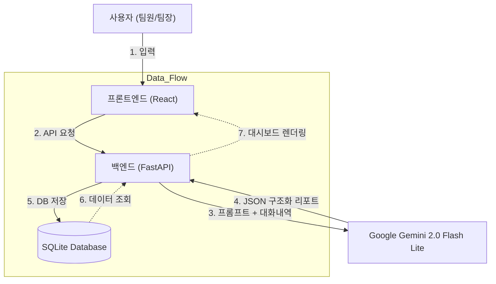

# HR-AI 최종 발표 자료 (Notion용 초안)

> **💡 발표 전략 Tips**
>
> - **Notion**에 이 내용을 그대로 복사해서 페이지를 만드세요.
> - **Mermaid** 코드는 Notion의 `/code` 블록에 붙여넣고 언어를 `Mermaid`로 설정하면 자동으로 다이어그램이 그려집니다.

---

## 1. 제안 개요 (Overview & Concept)

### 1.1 기획 의도 ("왜 만들었는가?")

- **문제점 (Pain Point)**
  - 팀원들은 매일 업무 보고를 작성하는 것이 귀찮고 번거로움.
  - 팀장님은 산재된 보고를 취합하고 개별 팀원의 상태를 파악하기 어려움.
- **해결책 (Solution)**
  - **"대화만 하면 리포트가 뚝딱!"**
  - 챗봇(AI)과 자연스럽게 대화하면, AI가 핵심 업무 내용을 추출하여 **정형화된 보고서(JSON)**로 자동 변환합니다.
  - 팀장에게는 **실시간 대시보드**를 통해 팀원들의 현황을 한눈에 보여줍니다.

### 1.2 시스템 개념도 (System Architecture)

- **Frontend**: 사용자와의 인터랙션 (React, Vite)
- **Backend**: 데이터 처리 및 AI 중계 (FastAPI)
- **AI Brain**: 비정형 텍스트 분석 및 구조화 (Google Gemini 2.0 Flash Lite)
- **Infra**: 하이브리드 배포 (Vercel + Ngrok)

### 1.3 시스템 흐름도 (Mermaid)



---

## 2. 사용자 기능 (Use Case Diagram)

사용자는 크게 **팀원(Member)**과 **팀장(Leader)**으로 나뉩니다.

```mermaid
usecaseDiagram
    actor M as "팀원 (Member)"
    actor L as "팀장 (Leader)"

    package "HR-AI System" {
        usecase "AI와 업무 대화" as UC1
        usecase "자동 리포트 생성" as UC2
        usecase "내 리포트 이력 조회" as UC3
        usecase "팀원별 리포트 모아보기" as UC4
        usecase "리포트 상세 열람" as UC5
    }

    M --> UC1
    M --> UC2
    M --> UC3
    L --> UC4
    L --> UC5
    UC1 ..> UC2 : Include
```

- **팀원**: 출퇴근 체크, 업무 내용 공유, 이슈 리포팅
- **팀장**: 팀 전체 업무 흐름 파악, 개별 팀원 상세 피드백

---

## 3. 주차별 개발 진행 (Progress)

### 📅 1주차: 기획 및 백엔드 기초

- **주요 활동**: 요구사항 분석 및 DB 설계
- **구현 내용**:
  - `FastAPI` 프로젝트 세팅
  - 데이터베이스 모델링 (User, ChatRoom, Message, Report)
  - 기본 CRUD API 구현
- **고민**: "어떻게 하면 팀장과 팀원을 구분할까?" → RBAC(Role-Based Access Control) 패턴 도입.

### 📅 2주차: AI 연동 및 핵심 로직

- **주요 활동**: OpenAI API 연동 및 프롬프트 엔지니어링
- **구현 내용**:
  - **Structured Output**: AI가 주저리주저리 말하는 것을 방지하고, 정확한 JSON 포맷(`summary`, `tasks`, `issues`)으로 뱉어내도록 강제.
  - **중복 방지 로직**: 동일한 대화방에서 리포트가 무분별하게 생성되지 않도록 검증 로직 추가.
- **시행착오**:
  - _문제_: AI가 가끔 리포트 형식을 어기는 문제.
  - _해결_: Pydantic 모델을 사용하여 AI 응답을 엄격하게 검증(`msgspec` / `response_format`).

### 📅 3주차: 프론트엔드 및 배포

- **주요 활동**: UI/UX 고도화 및 하이브리드 배포
- **구현 내용**:
  - **Dashboard UI**: Tailwind CSS로 반응형 대시보드 구현.
  - **Authentication**: JWT 흐름을 모방한 `AuthContext` 구현 및 Axios Interceptor 적용.
  - **Deployment**: Vercel(Frontend)과 Ngrok(Backend)을 연동하여 외부 접속 환경 구축.
- **최종 터치**: 로고 변경(Person Icon), 타이틀 수정, 에러 핸들링 강화.

---

## 4. 주요 개발 코드 (Key Code)

### 🔑 차별점 1: AI 구조화 답변 (Structured Output)

단순 챗봇을 넘어, 업무 시스템에 데이터를 연동하기 위해 **JSON 모드**를 활용했습니다.

```python
# back_hr_ai/main.py (Concept)

# Pydantic 모델로 AI에게 "이 양식대로만 뱉어!"라고 지시
class ReportFormat(BaseModel):
    summary: str
    key_tasks: List[str]
    issues: Optional[str]

response = client.chat.completions.create(
    model="gemini-2.0-flash-lite",
    messages=[...],
    response_format={ "type": "json_object" } # 핵심!
)
```

### 🔑 차별점 2: 하이브리드 배포와 보안 우회

무료 배포 환경의 한계를 기술적으로 극복했습니다.

```javascript
// front_hr_ai/src/contexts/AuthContext.jsx

// Ngrok 무료 버전의 '브라우저 경고'를 뚫기 위한 헤더 주입
config.headers["ngrok-skip-browser-warning"] = "69420";
```

---

## 5. 주요 기능 및 기대 효과 (Benefits)

### 🎥 주요 화면 (시연 포인트)

1.  **로그인**: 역할(팀장/팀원)에 따라 다른 메인 화면으로 이동.
2.  **채팅**: 자연스럽게 "오늘 백엔드 API 3개 만들었고, DB 설계 좀 바꿨어"라고 말하면 AI가 알아서 이해.
3.  **리포트 생성 버튼**: 대화가 끝나면 버튼 클릭 1번으로 보고서 완성.
4.  **팀장 대시보드**: 팀원들의 보고서가 실시간으로 로드되는 카드 뷰.

### 🚀 기대 효과 (Benefit)

- **Speed**: 보고서 작성 시간 90% 단축 (작문 스트레스 해소).
- **Quality**: AI가 핵심만 요약하므로 누락 없는 보고 가능.
- **Connectivity**: 모바일/PC 어디서든 접근 가능한 웹 서비스.

---

## 6. 결론 및 한계점

### 📝 결론

- 최신 LLM 기술(Gemini 2.0 Flash Lite)을 실제 업무 프로세스(HR)에 성공적으로 접목했습니다.
- 단순히 "말하는 AI"가 아니라 **"일을 대신 해주는 AI"**를 구현했습니다.

### 🚧 한계 및 향후 과제

- **로컬 의존성**: 현재 Backend가 로컬 PC(Ngrok)에 의존적입니다. 향후 AWS EC2 + Docker로 완전한 클라우드 마이그레이션을 목표로 합니다.
- **데이터 보안**: 엔터프라이즈 도입을 위해서는 사내 구축형 LLM(Llama 3 등) 도입을 고려해야 합니다.
